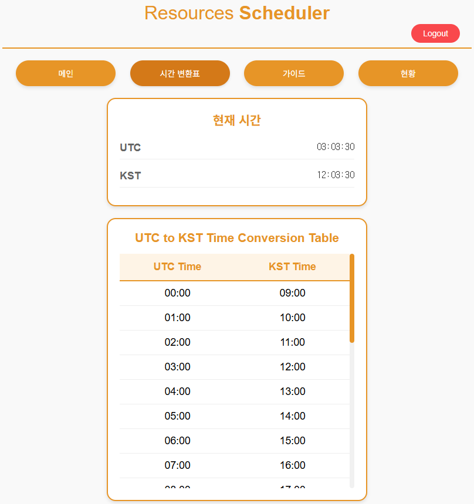

# AWS 리소스 스케줄러 🚀

## 📋 목차
- [프로젝트 소개](#-프로젝트-소개)
- [기능 소개](#-기능-소개)
- [시스템 아키텍처](#-시스템-아키텍처)
- [결과 화면](#-결과-화면)
- [기술 스택](#-기술-스택)
- [프로젝트 구조](#-프로젝트-구조)
- [기술적 경험](#-기술적-경험)
- [이슈 사항](#-이슈사항)

## 🎯 프로젝트 소개
AWS Amazon Elastic Compute Cloud(Amazon EC2) 및 Amazon Relational Database Service(Amazon RDS) 인스턴스의 시작과 중지를 웹 페이지를 통해 관리할 수 있는 서버리스 기반 스케줄러입니다.

### 💡 개발 배경
- 내부 팀과 고객의 AWS 리소스 관리 어려움 해소
- 웹 기반 플랫폼을 통한 직관적인 스케줄링 관리 시스템 구축
- 모바일 환경 지원으로 운영의 유연성과 접근성 향상
- 비용 효율적인 리소스 관리 실현

## 🔍 기능 소개
### 핵심 기능
- 리소스 스케줄링 관리
  - EC2/RDS 인스턴스 중지 일정 등록 및 수정
  - EC2/RDS 인스턴스 즉시 시작
  - Eventbridge 현황 확인
- 사용자 인증
  - JWT 기반 토큰 인증
  - 자동 로그아웃 (토큰 만료)
  - API 엔드포인트 보안 강화 (모든 API 요청에 인증 검증 적용)

### 인증 및 요청 처리 흐름
**Client (Frontend)**
1. 아이디, 패스워드로 로그인
2. 서버에서 발급한 토큰을 클라이언트의 cookie 에 토큰을 저장
3. 웹 페이지에서 페이지 전환 또는 API 요청 시 토큰의 유효성을 백엔드에서 검증

**Server (Backend)**
1. 로그인 시 토큰을 발급하여 dynamoDB 에 저장하고 클라이언트단에서는 쿠키에 토큰을 저장
2. 클라이언트에서 받은 모든 요청은 토큰을 확인
3. 시간이 지난 토큰이라면 로그아웃처리를 하고, 시간이 유효한 토큰이라면 요청을 처리
4. 모든 API 엔드포인트에서 JWT 토큰 검증을 수행하여 인증되지 않은 요청 차단

### 🔒 보안 강화 사항
- **API 엔드포인트 보안**: 모든 API 요청(`/api/start`, `/api/stop`, `/api/status`)에 JWT 토큰 검증 로직 추가
- **Postman 등 외부 도구 차단**: 인증 없이 API를 직접 호출하는 것을 방지
- **토큰 기반 인증**: 쿠키 기반 JWT 토큰으로 사용자 세션 관리
- **자동 로그아웃**: 토큰 만료 시 자동으로 로그인 페이지로 리다이렉트

## 🏗 시스템 아키텍처

**CloudFront, S3, Lambda, DynamoDB, API Gateway** 를 활용한 **서버리스 아키텍처**로 구성되었습니다. 이를 통해 **서버 관리에 대한 부담을 줄이고**, 사용량 기반 과금 구조를 활용함으로써 **비용 효율성을 극대화**할 수 있었습니다.  
특히, 상시 운영이 필요한 서버 인프라 없이도 필요한 시점에만 리소스를 동적으로 활용할 수 있어 **소규모 트래픽부터 일정 규모의 요청까지 유연하게 대응 가능**하며, 초기 인프라 구축 및 유지 비용을 최소화할 수 있다는 점에서 큰 이점을 갖습니다.

### 구성 제약 사항
 - **CloudFront**
 	- CloudFront와 API Gateway 연결 시, **경로는 배포한 스테이지의 경로(`/prod`, `/dev` 등)** 로 지정해야 함
    - 존재하지 않는 페이지로 접근 시, **사용자 경험 향상을 위해 커스텀 에러 페이지** 설정
    - **CloudFront Function**을 사용하여 뷰어 요청 시 JavaScript로 URL 확장자 제거 처리 (`.html`, `.jpg` 등 제거)
- **API Gateway**
    - Lambda와 연결 시, **Lambda Proxy 통합 기능을 사용**하여 요청의 전체 컨텍스트(헤더, 쿼리스트링, 바디 등)를 Lambda로 전달
    - Lambda Proxy 통합 사용 시, **브라우저의 CORS preflight 요청**(`OPTIONS` 메서드)을 Lambda에서 직접 처리해야 하며,  이때 `Access-Control-Allow-Origin`, `Access-Control-Allow-Headers`, `Access-Control-Allow-Methods` 등의 CORS 헤더를 포함한 응답을 반환해야 함
- **S3**
    - CloudFront와 연결 시, S3 버킷 정책 또는 퍼블릭 엑세스 설정 여부 확인 필수
- **Lambda**
	- Lambda 구성은 VPC 를 지정하여 구성하였으며, Python3.12 버전을 사용
	- JWT 라이브러리는 PyJWT 를 사용
	- JWT_SECRET 의 경우 Lambda 의 환경 변수로 설정하였기에, 추가적인 설정이 필요
- **DynamoDB**
	- user Table 의 컬럼은 id, password 로 구성
		- 파티션 키 : id
	- token Talbe 의 컬럼은 token, created_at, expires_at(TTL), id
		- 파티션 키 : token

### 🔧 배포 시 주의사항
- **Lambda 환경 변수 설정**: `JWT_SECRET` 환경 변수를 Lambda 함수에 설정해야 합니다.
- **Dependencies 설치**: `requirements.txt`에 정의된 Python 패키지들을 Lambda 레이어 또는 배포 패키지에 포함해야 합니다.
- **토큰 테이블 설정**: DynamoDB의 토큰 테이블에 적절한 TTL 설정이 필요합니다.

### 특장점
- **서버리스 아키텍처** 채택
	- 서버 관리 부담 최소화
	- 사용량 기반 과금으로 비용 효율성 극대화
	- 유연한 확장성
- **고가용성 설계**
	- CloudFront CDN을 통한 글로벌 서비스 제공
	- API Gateway를 통한 안정적인 API 관리
	- DynamoDB의 높은 가용성 활용

## 🙌 결과 화면
**로그인**

최초 접근 시 나오는 로그인 페이지에서 DynamoDB에 저장된 ID, Password로 로그인 합니다.

**메인**

메인 페이지에서 리소스 스케줄링을 적용할 수 있습니다.

**시간 변환표**

UTC 시간에 익숙하지 않은 사용자도 표를 통해 이해할 수 있도록 적용했습니다.

**리소스 스케줄링(중지 시간 조정)**


Scheduler 대상 추가 시 EC2 & RDS 의 Tag 기반의 Eventbridge 이벤트 시간을 조정할 수 있도록 했습니다.

**리소스 스케줄링(리소스 시작)**


Scheduler 대상 기동 시 EC2 & RDS 의 Tag 기반의 리소스를 기동할 수 있도록 했습니다.

**리소스 스케줄링 현황**


스케줄 조정 이후, 각 서비스의 현황을 조건에 맞게 필터링하여 확인할 수 있습니다.

**리소스 스케줄링 사용자 경험 개선**


없는 페이지나 임의적으로 접근 시 에러페이지를 통한 메인으로 접근하며, 확장자를 제거하여 깔끔한 URL처리와 보안성 향상 시켰습니다.

## 🛠 기술 스택
### Frontend
- 
- 
- 

### Backend & Infrastructure
- 
- 
- 
- 
- 
- 

## 📁 프로젝트 구조
```tree
.
├── cloudfront-function/          # cloudfront 관련 함수
│   └── time.css                  # 뷰어 요청용 함수
├── css/                          # 스타일시트 파일
│   ├── auth.css                  # 인증 관련 스타일
│   ├── common.css                # 공통 스타일
│   ├── error.css                 # 에러 페이지 스타일
│   ├── guide.css                 # 가이드 페이지 스타일
│   ├── login.css                 # 로그인 페이지 스타일
│   ├── main.css                  # 메인 페이지 스타일
│   ├── status.css                # 현황 페이지 스타일
│   └── time.css                  # UTC 및 KST 시간 관련 스타일
│
├── images/                       # 이미지 리소스
│   ├── clock.png                 # 시계 이미지
│   ├── env-select.svg            # 환경 선택 아이콘
│   ├── login.PNG                 # 로그인 페이지 이미지
│   ├── refresh.png               # 현황 재시도 버튼 이미지
│   ├── runcat.gif                # 애니메이션 이미지
│   ├── scheduler-1.PNG           # 스케줄러 스크린샷 1
│   ├── scheduler-2.PNG           # 스케줄러 스크린샷 2
│   └── timetalbe.PNG             # 시간표 이미지
│
├── js/                           # 클라이언트 사이드 스크립트
│   ├── auth.js                   # 인증 관련 기능
│   ├── login.js                  # 로그인 기능
│   ├── logout.js                 # 로그아웃 기능
│   ├── main.js                   # 스케줄링 기능
│   ├── status.js                 # 스케줄링 현황 기능
│   └── time.js                   # UTC/KST 시간 관리
│
├── pages/                        # HTML 페이지
│   ├── guide.html                # 가이드 페이지
│   ├── main.html                 # 메인 페이지
│   └── time.html                 # 시간 관리 페이지
│
├── lambda/                       # AWS Lambda 함수
│   ├── lambda-api.py             # 스케줄링 처리
│   ├── lambda-auth.py            # 인증 처리
│   ├── lambda-startscheduler.py  # 리소스 시작
│   ├── lambda-status.py          # Eventbridge 현황
│   └── lambda-stopscheduler.py   # 리소스 중지
│
├── error.html                    # 에러 페이지
└── index.html                    # 로그인 페이지
```

## 💻 기술적 경험
### Frontend 개발
- 사용자 중심의 UI/UX 구현
	- 직관적인 스케줄링 인터페이스 설계
	- 모바일 최적화된 반응형 디자인
- AWS 인프라 활용
	- CloudFront와 S3 기반 정적 웹사이트 호스팅
	- CDN을 통한 글로벌 성능 최적화
- 보안 강화
	- JWT 기반 클라이언트 인증

### Backend 개발
- 서버리스 아키텍처 설계
	- AWS Lambda 기반 마이크로서비스 구현
- API 개발 및 보안
	- RESTful API 설계 및 구현
	- API Gateway 를 통한 엔드포인트 보안
- 데이터베이스 설계
	- DynamoDB 스키마 최적화
	- TTL 을 활용한 토큰 관리

## 🐞 이슈사항
### 인증 및 보안 관련
- **로그인 기능**
	- 로그인 후 `/` 접근 시 `main`페이지 리다이렉트
- **로그아웃 기능**  
	- 클라이언트 쿠키 삭제 후, 백엔드 DynamoDB에서 해당 토큰 행 삭제
- **JWT 토큰 인증**  
	- 모든 페이지 접근 시 `auth.js`를 통해 토큰 유효성 검증
- **페이지 접근 제어**  
	- 로그인하지 않은 상태에서 `main` 등 페이지 접근 시 로그인 페이지로 이동
- **없는 페이지 접근 처리**  
	- CloudFront 커스텀 에러 페이지로 graceful하게 처리
- **DynamoDB TTL** 
	- 시간이 지난 데이터는 삭제하여 보안성향상 및 불필요 데이터 처리
### API 및 UI 관련
- **스케줄링 API 보안 처리** 
	- 토큰이 없거나 만료된 경우 API 요청 불가
	- API Gateway 의 특성상  29초 초과 시 Timeout Error 반환을 클라이언트에서 비동기 요청 및 재시도를 통한 문제 해결
- **초기 로딩 시 페이지 노출 방지**  
	- 로그인하지 않은 사용자가 직접 경로 입력 시 페이지가 잠깐 보이는 문제 해결  
	- `auth.css`로 초기 로딩 시까지 화면 비노출 처리
- **API Gateway + Lambda 연동 시 이벤트 수신 문제**
	- Lambda 프록시 통합 미사용 시, 요청 데이터가 Lambda로 전달되지 않아 `event` 객체가 비어 있음
	- 이를 해결하기 위해 Lambda 프록시 통합을 활성화하여 헤더, 쿼리스트링, 바디 등 전체 요청 정보를 자동으로 Lambda에 전달하도록 구성함
	- Lambda 프록시 통합을 사용하지 않는 경우, 요청 데이터를 Lambda에 수동으로 전달하기 위해 **매핑 템플릿**을 작성해야 함
		- 매핑 템플릿이 없으면, **event** 객체에는 필요한 정보(예: 헤더, 쿼리, 바디 등)가 포함되지 않으며 정상 처리 불가
